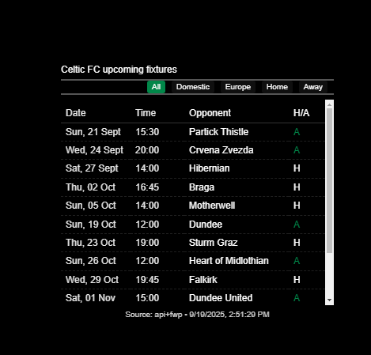
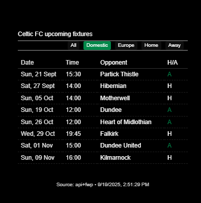
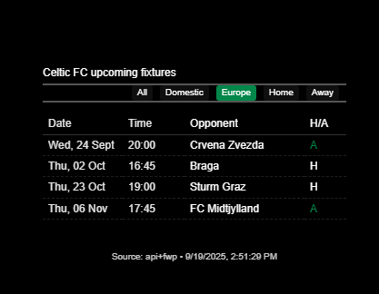
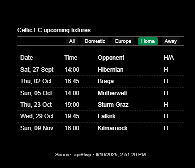
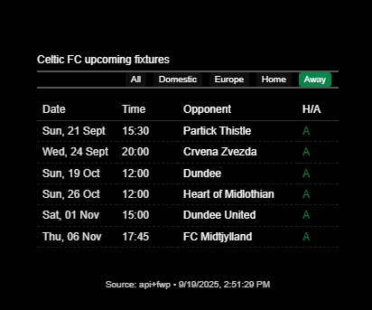
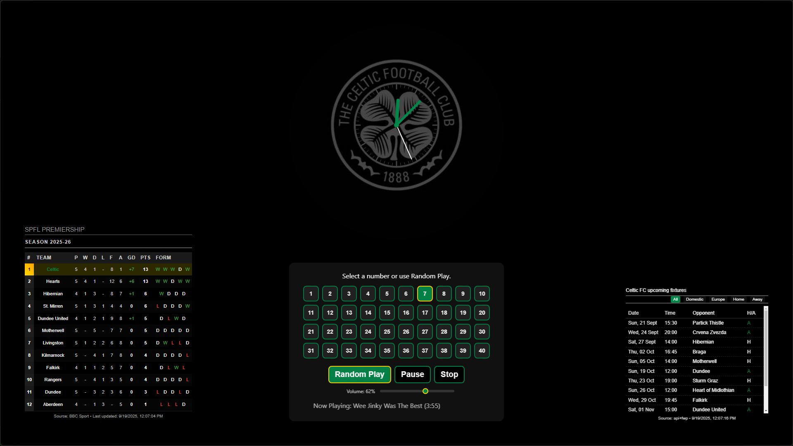

# MMM-MyTeams-Fixtures

A MagicMirror² module that displays upcoming fixtures for your football team. It uses TheSportsDB API as the primary data source and can complement missing data with a reputable scraper (FootballWebPages) to ensure away fixtures always appear.

- Primary API: TheSportsDB (v3)
- Optional supplement: FootballWebPages (FWP) when API lacks away fixtures (n.b free API only returns home fixtures)
- Features: Auto season detection, caching, H/A indicator, optional competition name, optional countdown, client-side filters, source footer 

## Screenshots
- 1: All fixtures view   
- 2: Domestic filter     
- 3: European filter      
- 4: Home filter          
- 5: Away filter          


## Table of Contents
- Features
- Screenshots
- Installation
- Configuration
- Options (config table)
- How data fetching works 
- Minimum config example
- Dependencies
- To Do
- License

## Features
- Shows date, time, opponent, H/A, competition
- Live countdown (optional)
- Client-side filters: All, Domestic, European, Home, Away
- Auto-detect season (e.g., 2025-2026)
- Caching to avoid rate limits
- Clear footer with source and timestamp


## Installation

1. Navigate to your MagicMirror modules folder:
   ```bash
   cd ~/MagicMirror/modules
   ```
2. Clone or copy this module into `MMM-MyTeams-Fixtures`:

   ```bash
   git clone https://github.com/gitgitaway/MMM-MyTeams-Fixtures
   ```
3. Install dependencies
```bash
npm install
```

4. Add the config to ~/MagicMirror/config/config.js`

5. Restart MagicMirror.

## Configuration
Add to your MagicMirror config.js:
```javascript

{
  module: "MMM-MyTeams-Fixtures",
  position: "bottom_right",
  config: {
    source: "api",
    teamName: "Celtic",
    teamId: "133647",
    apiUrl: "https://www.thesportsdb.com/api/v1/json/3",
    season: "auto",
    fallbackSeason: "2025-2026",
    updateInterval: 10 * 60 * 1000,
    requestTimeoutMs: 15000,
    maxFixtures: 12,
    showCompetition: true,
    showCountdown: true,
    defaultFilter: "all",
    cacheTTL: 5 * 60 * 1000,
    fallbackChain: true,
    // Filtering helpers
    scottishLeagueIds: ["4330", "4364", "4363", "4888"],
    uefaLeagueIds: ["4480", "4481", "5071"],
    // API fallback behavior
    useSearchEventsFallback: true,
    strictLeagueFiltering: true,
    // Scrapers (used only as needed)
    scrapeFWP: true,
    scrapeBBC: false,
    scrapeLFOTV: false,
    scrapeCFC: false,
    scrapeSportsDB: false,
    // Locale
    locale: "en-GB",
    // Debug
    debug: false
  }
}
```

## Options
| Option | Type | Default | Description |
|-------|------|---------|-------------|
| source | string | "api" | Primary source: "api" or scrapers via fallbackChain |
| teamName | string | "Celtic" | Team display name and used for some fallbacks |
| teamId | string | "133647" | TheSportsDB team ID (Celtic Scotland) |
| apiUrl | string | https://www.thesportsdb.com/api/v1/json/3 | API base URL |
| season | string | "auto" | Season string (e.g., "2025-2026") or "auto" |
| fallbackSeason | string | "2025-2026" | Secondary season for API fallback |
| updateInterval | number | 600000 | Refresh interval in ms |
| requestTimeoutMs | number | 15000 | Fetch timeout in ms |
| maxFixtures | number | 10 | Max fixtures shown |
| showCompetition | boolean | true | Show competition column |
| showCountdown | boolean | true | Show countdown to each match |
| defaultFilter | string | "all" | "all" | "domestic" | "european" | "home" | "away" |
| cacheTTL | number | 300000 | Cache duration in ms |
| fallbackChain | boolean | true | Try scrapers if API empty |
| scottishLeagueIds | string[] | [4330,4364,4363,4888] | Allowed Scottish competition IDs |
| uefaLeagueIds | string[] | [4480,4481,5071] | Allowed UEFA competition IDs |
| useSearchEventsFallback | boolean | true | Try searchevents patterns if API returns no data |
| strictLeagueFiltering | boolean | true | Enforce league IDs for filtering in API stage |
| scrapeFWP | boolean | true | Enable FWP scraper (for supplement/fallback) |
| scrapeBBC | boolean | true | Enable BBC scraper (fallback) |
| scrapeLFOTV | boolean | true | Enable LiveFootballOnTV scraper (fallback) |
| scrapeCFC | boolean | true | Enable Celtic FC site scraper (fallback) |
| scrapeSportsDB | boolean | true | Enable TheSportsDB site scraper (fallback) |
| locale | string | "en-GB" | Date/time formatting locale |
| debug | boolean | false | Verbose logging |

## How data fetching works (plain language)
1. The module asks the helper for fixtures. The helper first calls TheSportsDB: eventsnext (upcoming) and eventsseason (season list). It filters to Celtic matches and known leagues.
2. If TheSportsDB returns only home games (common with free tier), the helper will check FootballWebPages for away games and merge them in (with date inference so they sort correctly). You’ll see "Source: api+fwp" in the footer when this happens.
3. If everything is empty (rare), optional scrapers (BBC, LiveFootballOnTV, Celtic site, SportsDB site) can be tried in order if enabled.
4. The front-end sorts and displays the merged list, and you can filter it with the buttons.


## Dependencies
- MagicMirror² (runtime)
- Node.js 18+
- npm packages: cheerio, node-fetch (or global fetch in Node 18), fs (built-in)

## To Do
- [x] Supplement API data with FWP to include away fixtures
- [x] Add robust debug logging and cache metadata
- [ ] Add logo mapping for more clubs and competitions
- [ ] Add per-league toggle to hide specific competitions

This id the 3rd module in my Celtic themed man cave magicmirror.  
- 

 The other modules can be found here:- 
- Module 1: MyTeams-Clock  https://github.com/gitgitaway/MMM-MyTeams-Clock
- Module 2: MyTeams-Clock  https://github.com/gitgitaway/MMM-MyTeams-LeagueTable
- Module 4: MyTeams-Clock  https://github.com/gitgitaway/MMM-JukeBox
---
## Acknowledgments
Thanks to the MagicMirror community for inspiration and guidance! Special thanks to @jclarke0000 for his work on MMM-MyScoreboard which served as a starting point. 


## License

MIT

