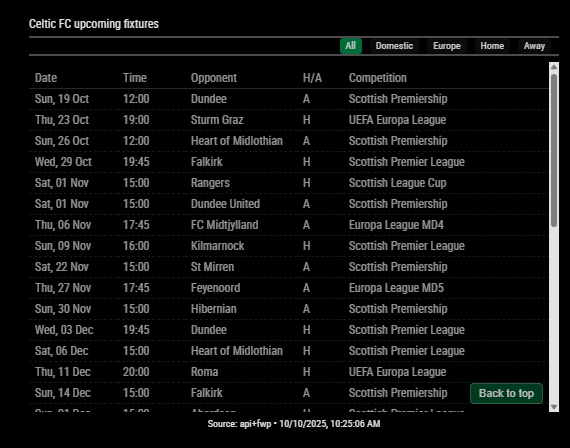
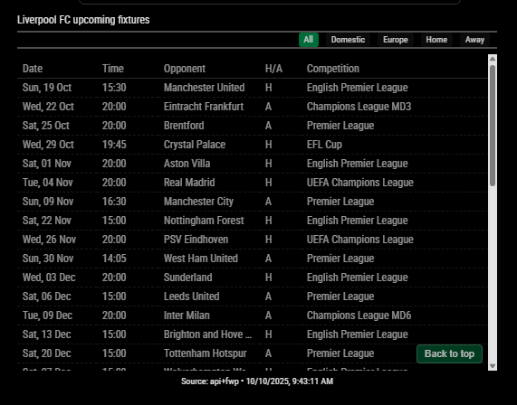
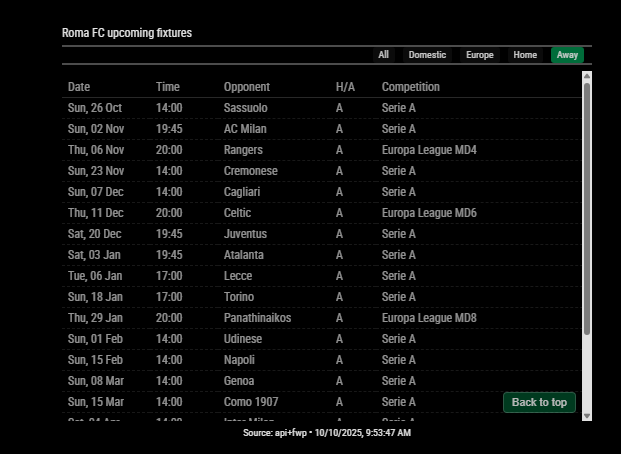
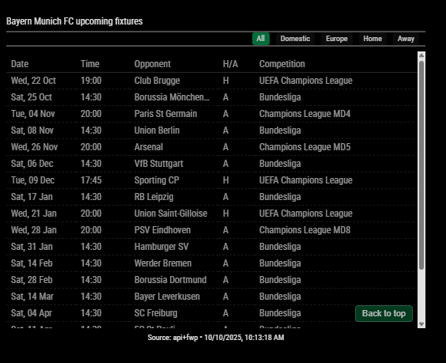

# MMM-MyTeams-Fixtures

A [MagicMirror²](https://magicmirror.builders/) module that displays upcoming football fixtures for **any team** by scraping FootballWebPages, Wikipedia, BBC Sport, LiveFootballOnTV, and (when supported) the club's own site.

[](CHANGELOG.md)
[](LICENSE)
[](https://magicmirror.builders/)

---

## Screenshots

*Celtic · Liverpool · Bayern Munich · Roma*

| | |
|-|-|
|  |  |
|  |  |

---

## Features

- **Works with any team** — Scottish, English, Spanish, European, or any club with a public fixture page
- **Five scrapers in one chain** — FootballWebPages · Wikipedia · BBC Sport · LiveFootballOnTV · club-site (CFC). The chain tries each in turn until one returns fixtures.
- **Filter tabs** — All · Domestic · European · Home · Away (with live fixture counts)
- **Auto-cycle** — Automatically rotates through selected filter views on a timer
- **Multi-team** — Switch between multiple clubs without restarting (INN-003)
- **Live match display** — In-progress score shown with `🔴` badge (INN-002)
- **Next-match countdown** — `⏱ Xd Yh` badge in the header (INN-001)
- **Pre-match alerts** — MagicMirror notification N minutes before kick-off (INN-004)
- **Skeleton loader** — Shimmer placeholder while fetching data
- **Stale data warning** — Amber footer when cached data is older than 2× TTL
- **Fully accessible** — Keyboard navigable, ARIA labels, screen reader table captions
- **Internationalised** — 9 languages: en · de · es · fr · ga · gd · it · nl · pt
- **Themeable** — CSS custom property (`--mmf-accent-color`) for your team's brand colour
- **Dual caching** — In-memory + disk cache survives restarts
- **Rate-limited** — Shared Request Manager prevents site throttling

---

## Why Scrapers (and Not TheSportsDB)?

Through v1.x this module used TheSportsDB's JSON API as its primary source. As of mid-2026 the free TheSportsDB tier only returns a single fixture per query, which made it unreliable for displaying a full season schedule. TheSportsDB scrape support has also been removed.

Version 2.0.0 is **scrapers only**. FWP remains the most reliable source for most clubs; Wikipedia provides an excellent backup when FWP cannot resolve the team; BBC and LiveFootballOnTV add broadcast-specific information where exposed by the source page; the club-site scraper exists for the small set of clubs whose official site publishes clean tables.

See [`HowThisModuleWorks.md`](documentation/HowThisModuleWorks.md) for the full architecture.

---

## Installation

```bash
cd ~/MagicMirror/modules
git clone https://github.com/gitgitaway/MMM-MyTeams-Fixtures
cd MMM-MyTeams-Fixtures
npm install
```

---

## Update

```bash
cd ~/MagicMirror/modules/MMM-MyTeams-Fixtures
git pull
npm install
```

---

## Configuration

Add the module to `~/MagicMirror/config/config.js`:

### Minimal Example

```javascript
{
  module: "MMM-MyTeams-Fixtures",
  position: "bottom_right",
  config: {
    teamName: "Liverpool"
  }
}
```

That's all you need for the default chain (FWP → Wikipedia → BBC → LiveFootballOnTV → CFC).

### Full Example (Celtic FC)

```javascript
{
  module: "MMM-MyTeams-Fixtures",
  position: "bottom_right",
  config: {
    teamName: "Celtic",
    scrapeFWP: true,
    scrapeWikipedia: true,
    scrapeBBC: false,
    scrapeLFOTV: false,
    scrapeCFC: false,

    source: "fwp",
    updateInterval: 10 * 60 * 1000,
    maxFixtures: 60,

    showCompetition: true,
    showCountdown: true,
    showFooter: true,
    defaultFilter: "all",

    autoCycleFilters: true,
    autoCycleIntervalMs: 20000,
    cycleAll: true,
    cycleHome: true,
    cycleAway: true,

    accentColor: "#018749",
    locale: "en-GB",
    language: "en",
    debug: false
  }
}
```

### Choosing A Scraper (`source`)

The `source` option sets which scraper runs:

| `source` value | Behaviour |
|---|---|
| omitted / unset | Default chain — FWP → Wikipedia → BBC → LFOTV → CFC, ordered by scraper flags |
| `"fwp"` | FootballWebPages only |
| `"wikipedia"` | Wikipedia only |
| `"bbc"` | BBC Sport only |
| `"livefootballontv"` | LiveFootballOnTV only |
| `"cfc"` | Club official site only |

The scraper must also be enabled via its `scrape*` flag; otherwise the chain returns an error banner.

### Finding Your Team Name

Just specify `teamName` — the team name is used to build scraper URLs and to look up the right Wikipedia article. Examples:

- `"Celtic"` — FWP path `celtic`; Wikipedia article `Celtic F.C.`
- `"Liverpool"` — FWP path `liverpool`; Wikipedia article `Liverpool F.C.`
- `"Real Madrid"` — FWP path `real-madrid`

See [documentation/FindingYourTeamID.md](documentation/FindingYourTeamID.md) for the full lookup method and the common team names table.

---

## Config Options

| Option | Type | Default | Description |
|--------|------|---------|-------------|
| **`teamName`** | string | `"Celtic"` | Your team's name — used for scraper URL construction and Wikipedia lookup |
| `source` | string | *(chain)* | Optional: pin to a single scraper (`"fwp"`, `"wikipedia"`, `"bbc"`, `"livefootballontv"`, `"cfc"`) |
| `scrapeFWP` | boolean | `true` | Enable FootballWebPages scraper |
| `scrapeWikipedia` | boolean | `true` | Enable Wikipedia scraper (article-title lookup + season tables) |
| `scrapeBBC` | boolean | `false` | Enable BBC Sport scraper |
| `scrapeLFOTV` | boolean | `false` | Enable LiveFootballOnTV scraper |
| `scrapeCFC` | boolean | `false` | Enable club official-site scraper (known clubs only) |
| `updateInterval` | number | `600000` | Data refresh interval in ms (default: 10 min) |
| `requestTimeoutMs` | number | `15000` | Per-request timeout in ms |
| `maxFixtures` | number | `60` | Maximum number of fixtures to display |
| `cacheTTL` | number | `300000` | Cache lifetime in ms (default: 5 min) |
| `showCompetition` | boolean | `true` | Show competition column in table |
| `showCountdown` | boolean | `true` | Show `⏱ Xd Yh` countdown badge to next fixture |
| `showFooter` | boolean | `true` | Show source/timestamp footer |
| `defaultFilter` | string | `"all"` | Active filter on load: `"all"` \| `"domestic"` \| `"european"` \| `"home"` \| `"away"` |
| `maxTableHeight` | number | `260` | Max height (px) of the scrollable fixture table |
| `countdownIntervalMs` | number | `60000` | How often countdown badge refreshes (ms) |
| `largeListThreshold` | number | `12` | Fixture count above which countdown refresh is throttled |
| `largeListCountdownMultiplier` | number | `2` | Multiplier applied to `countdownIntervalMs` when list exceeds threshold |
| `autoCycleFilters` | boolean | `false` | Auto-rotate through enabled filter views |
| `autoCycleIntervalMs` | number | `20000` | Display duration per filter during auto-cycle (min 5000 ms) |
| `cycleAll` | boolean | `true` | Include "All" in auto-cycle rotation |
| `cycleHome` | boolean | `true` | Include "Home" in auto-cycle rotation |
| `cycleAway` | boolean | `true` | Include "Away" in auto-cycle rotation |
| `cycleDomestic` | boolean | `false` | Include "Domestic" in auto-cycle rotation |
| `cycleEuropean` | boolean | `false` | Include "European" in auto-cycle rotation |
| `locale` | string | `"en-GB"` | Locale for date/time formatting (e.g. `"de-DE"`, `"fr-FR"`) |
| `language` | string | `"en"` | UI language code: `en` `de` `es` `fr` `ga` `gd` `it` `nl` `pt` |
| `accentColor` | string | `"#018749"` | Team accent colour — sets `--mmf-accent-color` CSS variable |
| `venueHomeColor` | string | `"#FFFFFF"` | Home match indicator text color |
| `venueHomeBackground` | string | `"#28a745"` | Home match indicator background color |
| `venueAwayColor` | string | `"#FFFFFF"` | Away match indicator text color |
| `venueAwayBackground` | string | `"#dc3545"` | Away match indicator background color |
| `venueNeutralColor` | string | `"#FFFFFF"` | Neutral venue indicator text color |
| `venueNeutralBackground` | string | `"#007bff"` | Neutral venue indicator background color |
| `darkMode` | boolean\|null | `null` | `null` = auto, `true` = force dark, `false` = force light |
| `fontColorOverride` | string\|null | `null` | Force text colour, e.g. `"#FFFFFF"` |
| `opacityOverride` | number\|null | `null` | Force wrapper opacity `0.0`–`1.0` |
| `teams` | array\|null | `null` | Multi-team mode — array of `{ label, teamName }` objects |
| `enableAlerts` | boolean | `false` | Fire MagicMirror SHOW_ALERT notification before kick-off |
| `alertBeforeMinutes` | number | `30` | Minutes before kick-off to send the alert |
| `debug` | boolean | `false` | Verbose console logging for troubleshooting |

> **Bold** options are the ones most users need to change. Everything else can be left at its default.

### Legacy / Deprecated Config Options

The following options were removed in v2.0.0 and will be silently ignored by the new code:

| Removed in v2.0.0 | Why |
|---|---|
| `apiUrl` | API path was removed |
| `teamId` | API path was removed (slug-variants on `teamName` now drive the chain) |
| `season` | API path was removed |
| `fallbackSeason` | API path was removed |
| `leagueIds` | API path was removed |
| `uefaLeagueIds` | API path was removed |
| `strictLeagueFiltering` | API path was removed |
| `useSearchEventsFallback` | API path was removed |
| `fallbackChain` | Chain is the only path now — always enabled |
| `scrapeSportsDB` | TheSportsDB scraper was removed |

If your `config.js` still contains any of these entries, delete them. The module will continue to work without them but their presence no longer affects output.

---

## Documentation

Detailed guides are in the `documentation/` folder:

| Guide | Contents |
|-------|---------|
| [HowThisModuleWorks.md](documentation/HowThisModuleWorks.md) | Architecture, data flow, caching, filtering, footer messages, socket API |
| [Debug_Guide.md](documentation/Debug_Guide.md) | Enabling debug mode, complete log message reference, common log sequences |
| [FindingYourTeamID.md](documentation/FindingYourTeamID.md) | Team name lookup methods (FWP, Wikipedia, BBC) |
| [CustomisingTheDisplay.md](documentation/CustomisingTheDisplay.md) | CSS custom properties, theming, column options, `customOverrides.css` |
| [MultiTeamAndAlerts-Guide.md](documentation/MultiTeamAndAlerts-Guide.md) | Multi-team switcher setup, pre-match alert config |
| [LanguageAndTranslation-Guide.md](documentation/LanguageAndTranslation-Guide.md) | Supported languages, adding a new translation |
| [AccessibilityFeatures-Guide.md](documentation/AccessibilityFeatures-Guide.md) | ARIA implementation, keyboard navigation, screen reader support |
| [Troubleshooting.md](documentation/Troubleshooting.md) | Common issues, debug log reference, fixes |
| [SHARED_REQUEST_MANAGER.md](documentation/SHARED_REQUEST_MANAGER.md) | HTTP queue, rate limiting, retry logic internals |
| [Final_Module_Review.md](documentation/Final_Module_Review.md) | Open recommendations, status of historical findings, phased implementation plan |

---

## Dependencies

| Dependency | Version | Purpose |
|-----------|---------|---------|
| MagicMirror² | ≥ 2.x | Runtime environment |
| Node.js | ≥ 18 | Native `fetch`; or Node 16 + `node-fetch@2` |
| cheerio | ^1.1.2 | HTML parsing for web scrapers |
| node-fetch | ^2.7.0 | HTTP fallback for Node < 18 |

Install:
```bash
cd ~/MagicMirror/modules/MMM-MyTeams-Fixtures && npm install
```

---

## Related Modules — The MyTeams Suite

This is module 3 in the MyTeams MagicMirror collection:

| Module | Description |
|--------|-------------|
| [MMM-MyTeams-Clock](https://github.com/gitgitaway/MMM-MyTeams-Clock) | Team-branded clock |
| [MMM-MyTeams-LeagueTable](https://github.com/gitgitaway/MMM-MyTeams-LeagueTable) | League standings table |
| **MMM-MyTeams-Fixtures** | Upcoming fixtures *(this module)* |
| [MMM-JukeBox](https://github.com/gitgitaway/MMM-JukeBox) | Audio player |

---

## Contributing

Contributions are welcome!

1. Fork the repository
2. Create a feature branch: `git checkout -b feature/my-feature`
3. Commit your changes: `git commit -m 'Add my feature'`
4. Push: `git push origin feature/my-feature`
5. Open a Pull Request

Please:
- Follow the existing code style
- Test with multiple teams and sources
- Update the relevant documentation file if adding new config options
- Add translation keys to all 9 locale files if adding new UI strings

---

## Changelog

See [CHANGELOG.md](CHANGELOG.md) for the full history of changes.

**Current version: 2.0.0** — Removed TheSportsDB API path (free tier no longer returns full season). Added Wikipedia scraper with article-title lookup.

---

## Acknowledgments

- **@jclarke0000** — MMM-MyScoreboard served as early inspiration
- **[FootballWebPages](https://www.footballwebpages.co.uk/)** — Most reliable fixture source
- **[Wikipedia](https://en.wikipedia.org/)** — Strong secondary source via article-title lookup
- **[BBC Sport](https://www.bbc.co.uk/sport)** — Fixture pages used for BBC scraper
- **[LiveFootballOnTV](https://www.live-footballontv.com/)** — Broadcast-aware fixture source
- **MagicMirror² Community** — Guidance, feedback, and support

---

## License

[MIT](LICENSE) — © gitgitaway
